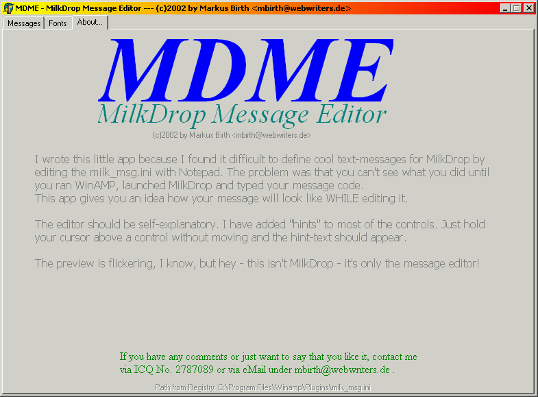
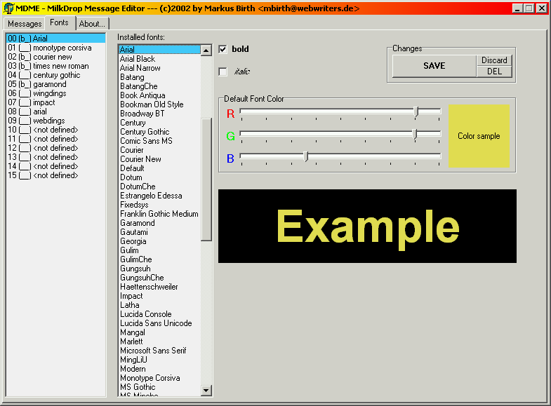
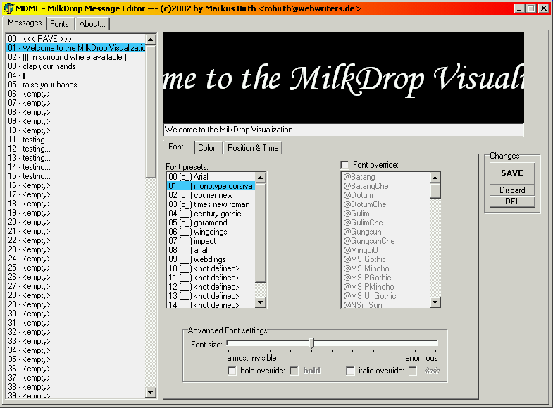
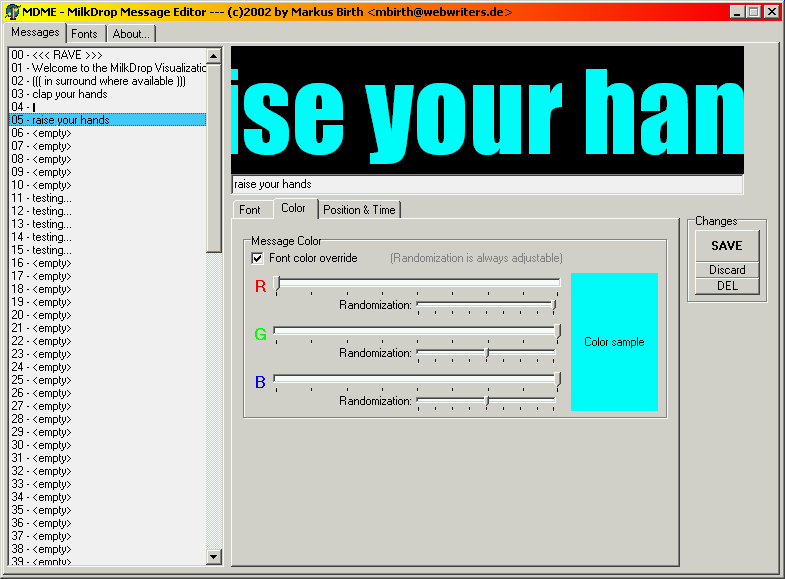
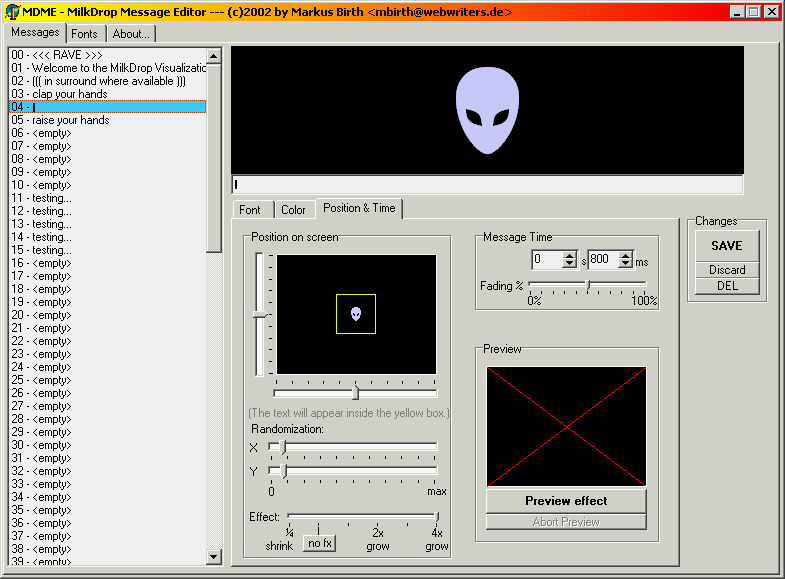

MDME - MilkDrop Message Editor
==============================

The famous [MilkDrop](http://www.geisswerks.com/milkdrop/) plugin for WinAMP has
a feature to display text messages with some special effects on the screen. A decade
ago, this was only configurable by editing some ini file and then checking the
results in WinAMP. Repeat until you're satisfied.

To make things easier, I wrote a simple simulator which gives you an idea of how
the result will look like. So you can simply add various messages in a short time.

Here are some screenshots:

